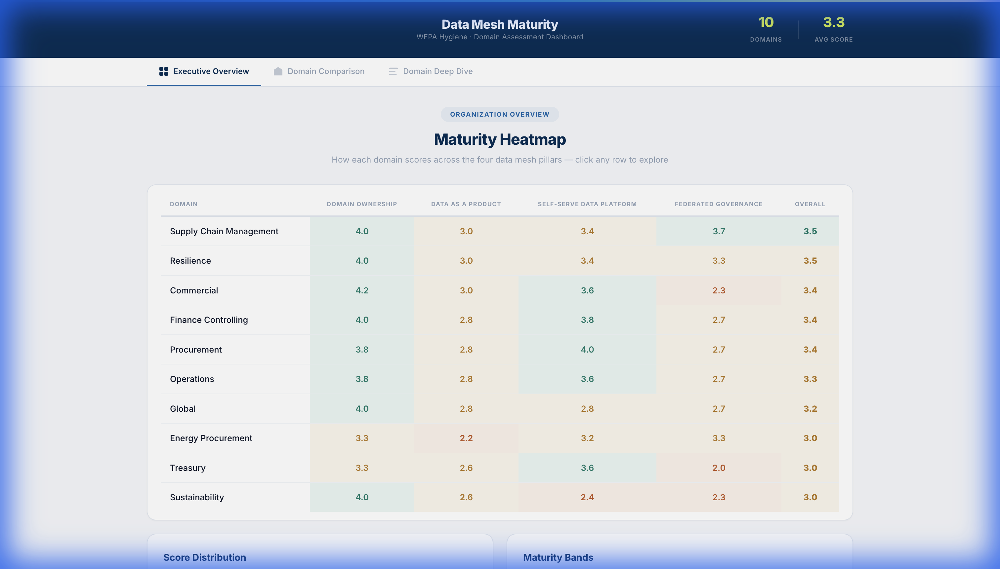
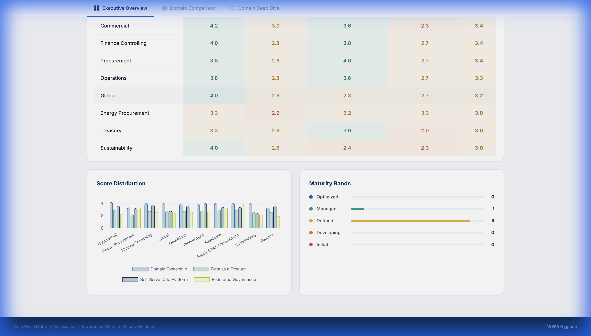
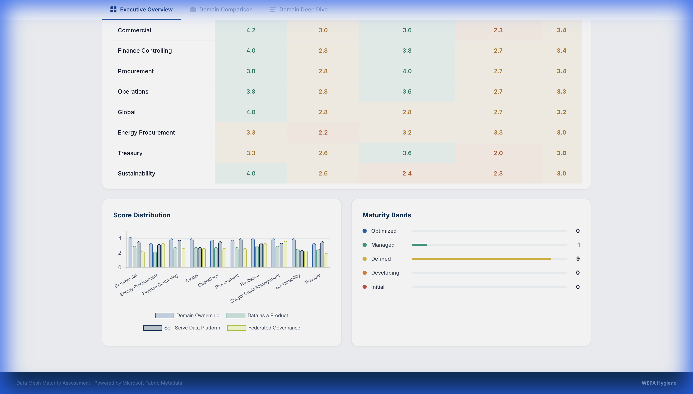
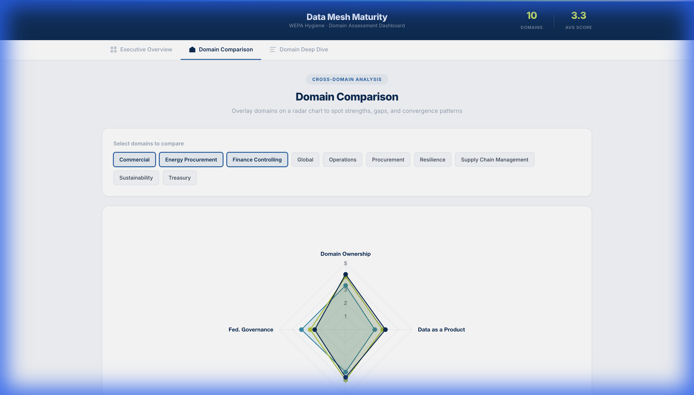
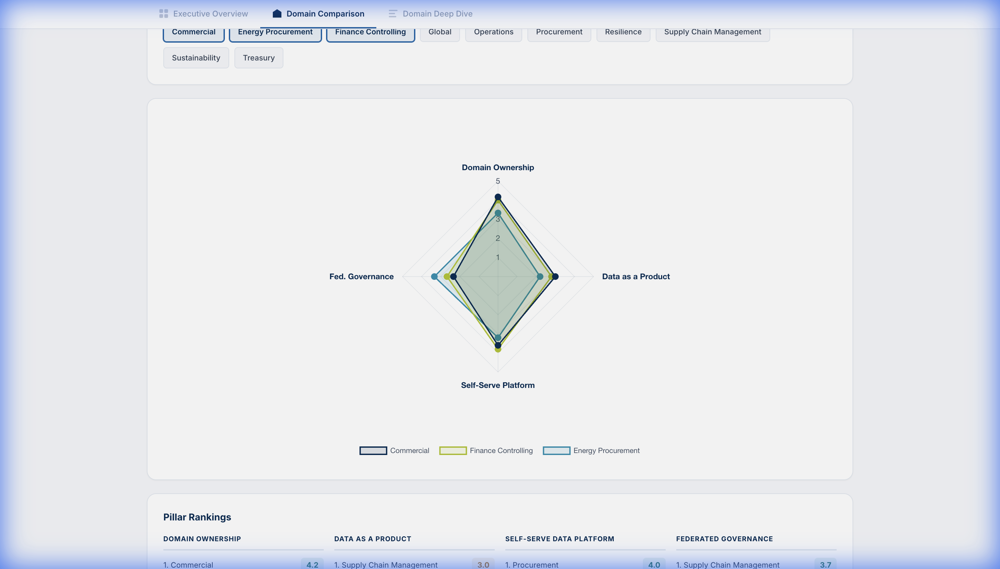
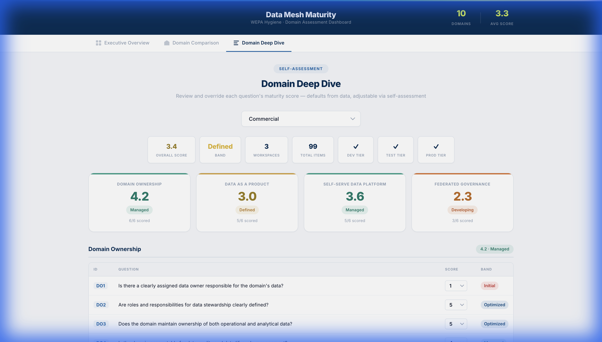
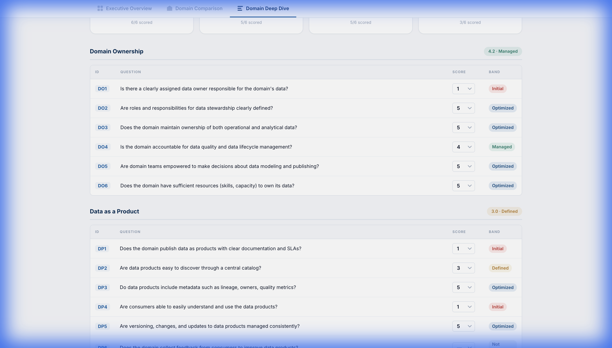
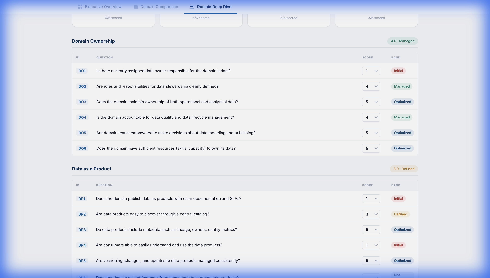

# 📊 Data Mesh Maturity Dashboard

**WEPA Hygiene · Domain Assessment Dashboard**

A web-based assessment tool that evaluates the data maturity of 10 business domains across the four pillars of **Data Mesh** architecture. It automatically computes evidence-based scores from Microsoft Fabric metadata and enables team members to perform interactive self-assessments.

---

## ️ What It Measures

The dashboard assesses **10 WEPA data domains** against the **4 pillars** of Data Mesh, with **24 questions** total:

| Pillar | Questions | What It Evaluates |
|--------|-----------|-------------------|
| **Domain Ownership** | DO1–DO6 | Data ownership, stewardship, accountability, and team capacity |
| **Data as a Product** | DP1–DP6 | Documentation, discoverability, metadata, usability, versioning |
| **Self-Serve Data Platform** | SP1–SP6 | Pipeline autonomy, CI/CD, monitoring, reusable patterns |
| **Federated Governance** | FG1–FG6 | Standards compliance, data quality, security, audit trails |

### Maturity Bands

Each score (1–5) maps to a maturity band:

| Score | Band | Meaning |
|-------|------|---------|
| 4.5 – 5.0 | 🔵 **Optimized** | Industry-leading, continuously improving |
| 3.5 – 4.4 | 🟢 **Managed** | Well-structured, proactively maintained |
| 2.5 – 3.4 | 🟡 **Defined** | Established processes, room for growth |
| 1.5 – 2.4 | 🟠 **Developing** | Early stages, foundational work in progress |
| 1.0 – 1.4 | 🔴 **Initial** | Minimal maturity, significant gaps |

---

## 📱 Dashboard Views

### 1. Executive Overview

The landing page provides a bird's-eye view of all domains' maturity levels.



**Key features:**
- **Header metrics** — Total domains and average score across the organization
- **Maturity Heatmap** — Color-coded table showing each domain's scores across all 4 pillars, sorted from highest to lowest maturity
- **Score Distribution** — Bar chart comparing pillar scores across domains
- **Maturity Bands** — Summary showing how many domains fall into each band





---

### 2. Domain Comparison

Compare up to 10 domains side-by-side using a **radar chart**.



**Key features:**
- **Toggle domains** on/off to focus on specific comparisons
- **Radar visualization** shows strengths and weaknesses across all 4 pillars
- **Pillar Rankings** below the chart show which domains lead in each pillar



---

### 3. Domain Deep Dive

The most interactive view — drill down into any domain's question-level scores.



**Key features:**
- **Stats bar** — Overall score, maturity band, workspace count, item count, and tier presence (DEV/TEST/PROD)
- **Pillar cards** — Score and band for each of the 4 pillars with completion status
- **Question tables** — All 24 questions grouped by pillar, each with a score dropdown



#### ✏️ Self-Assessment & Score Overrides

Any team member can **override scores** using the dropdown next to each question. When you change a score:

1. The **question's maturity band** updates instantly
2. The **pillar average** recalculates in real time
3. The **domain's overall score** adjusts accordingly
4. The **Executive Overview** charts and heatmap update automatically



> **Note:** Score overrides are **saved to the backend** and persist across page refreshes and sessions. All team members see the same overridden scores.

---

## 🔧 How Scores Are Computed

Scores fall into two categories:

| Mode | Description |
|------|-------------|
| **Auto / Semi** | Computed automatically from Microsoft Fabric metadata (CSV exports). The system analyzes workspace descriptions, item documentation, pipeline counts, deployment tiers, etc. |
| **Manual** | Requires human assessment. These questions have no dropdown pre-selected and must be scored by the team. |

The percentage-to-score mapping:
- **80–100%** → Score 5 (Optimized)
- **60–79%** → Score 4 (Managed)
- **40–59%** → Score 3 (Defined)
- **20–39%** → Score 2 (Developing)
- **0–19%** → Score 1 (Initial)

---

## 🌐 Accessing the Dashboard

The dashboard is hosted on **Render** and accessible at:

🔗 **[https://data-mesh-maturity.onrender.com](https://data-mesh-maturity.onrender.com)**

> **First load may take ~30 seconds** as Render's free tier spins up on demand.

---

## 📁 Technical Architecture

```
maturity_dashboard/
├── app.py              # Flask server (lightweight JSON-serving version)
├── app_full.py         # Full version with CSV processing (local use)
├── requirements.txt    # Python dependencies (Flask + Gunicorn)
├── render.yaml         # Render deployment blueprint
├── data/
│   ├── domains.json    # Pre-computed domain summaries
│   ├── overview.json   # Cross-domain comparison matrix
│   └── details.json    # Full question-level scores per domain
├── templates/
│   └── index.html      # Main HTML template
├── static/
│   ├── app.js          # Dashboard logic & interactivity
│   └── style.css       # Styling & design system
└── docs/
    └── README.md       # This file
```

---

## 🤝 For the Team

### How to use this dashboard:

1. **Start with Executive Overview** — See which domains need the most attention
2. **Use Domain Comparison** — Identify patterns across domains
3. **Go to Deep Dive** — Select your domain and review each question
4. **Override scores** — Adjust any auto-computed score based on your domain knowledge
5. **Share insights** — Use the maturity bands to guide data mesh improvement initiatives

### Questions this dashboard helps answer:

- *"Which domains are most mature in Data Mesh adoption?"*
- *"Where are the biggest gaps across our organization?"*
- *"How does my domain compare to others on specific pillars?"*
- *"What specific areas should we focus on improving?"*

---

*Built for WEPA Hygiene · Data & Analytics Team · February 2026*
